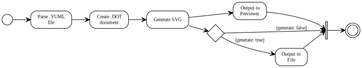

# yUML extension
yUML extension for Visual Studio Code. Allows the creation of UML diagrams based on the [yUML Syntax](http://yuml.me/).

## Features
* Syntax highlighting of *.yuml* files
* Currently, the following diagram types are supported: 
  + Class
  + Activity 
  + Use-case
  + State
* Update of yUML diagrams after each file save
* Additional directives for altering diagram type and orientation
* Embedded rendering engine: No need to call an external web service
* Code snippets with samples of each diagram

## yUML syntax
Please refer to the [wiki page](https://github.com/jaime-olivares/vscode-yuml/wiki)

## Invocation methods
Once a *.yuml* file is open, the viewer window can be invoked in two ways:
* By opening the command pallete and [partially] typing: `view yuml diagram`
* By right clicking on the document's title tab and selecting the option: *View yUML Diagram*

## Snippets
There is a snippet for each diagram type. Just start typing one of the available diagram types: `class`, `activity`, `usecase` or `state`
and a full example will be pasted into the yuml file.

## Extension Settings
No settings yet.

## Dependencies
This extension only depends on [viz.js](https://github.com/mdaines/viz.js), which is installed automatically.
No other product or library is needed and thus the installation process is quietly simple.

## Internals
The following activity diagram depicts the principal steps to generate the UML diagram:

## Issue reporting
If you have experience developing Visual Studio Code extensions, please propose a detailed solution for any reported issue.

## Roadmap
* Completion of other diagram types: sequence, components, deployment, etc.
* Diagram nesting
* Intellisense for colors

## Credits
* Syntax and some examples taken from [yuml.me](http://yuml.me/diagram/scruffy/class/samples)
* This extension uses a Javascript port of [Dot/Graphviz](http://www.graphviz.org/) called [viz.js](https://github.com/mdaines/viz.js)
* The yuml-to-dot translator is loosely based on a Python project called [scruffy](https://github.com/aivarsk/scruffy)
