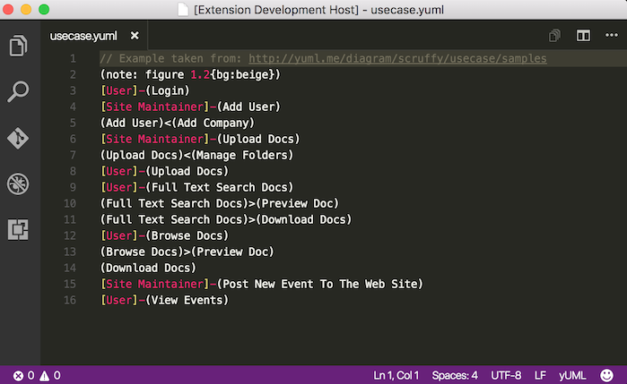

# yUML extension
yUML extension for Visual Studio Code. Enables the use of [yUML.me](http://yuml.me/) tools.

## Features
The unique feature in version 1.0.0 enables syntax highlighting of *.yuml* files, as shown:

 

## Extension Settings
No settings yet

## Roadmap
* **Preview window** (very soon)
* Intellisense for language syntax
* Intellisense for colors
* Settings for diagram size, orientation and drawing style

## Credits
* The syntax highlighting has been taken from [sublime-yuml](https://github.com/cluther/sublime-yuml) by Chet Luther
* Examples taken from [yuml.me](http://yuml.me/diagram/scruffy/class/samples)
